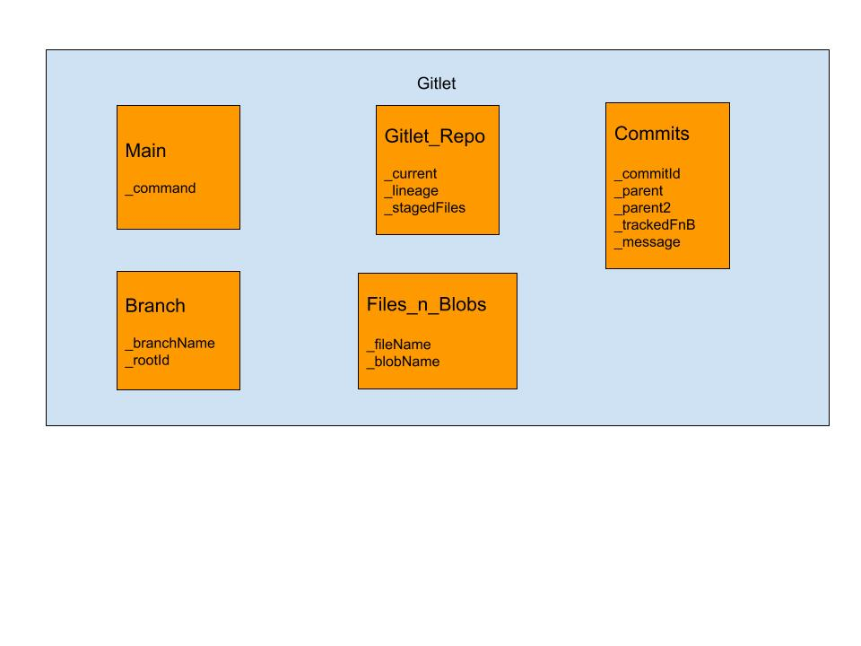

# Gitlet Design Document
author: Yash Pansari, Alexander Ge

## 1. Classes and Data Structures

### I. Commit
Contains all the useful information about a commit operation using the fields:
* String _commitId : The SHA-1  code of the commit (aka commit hash).
* Commit _parent : First parent of the commit. Defaults to null (initial commit).
* Commit _parent2 : The second parent of the commit. Defaults to null.
* ArrayList<Files_N_Blobs> _trackedFnB : Contains all the information about the files added to the commit.
* String _message : Message that the commit was created with
### II. Files_n_Blobs
Contains all the useful information about one specific file using the fields:
* String _fileName : Name of the file.
* String _blobName : SHA-1 hash code (blob name).
### III. Branch
Contains all the useful information to identify a branch using the fields:
* String _BranchName : Name of the branch.
* String _rootID : The commit id of the first commit that made the branch.
### IV. Gitlet_Repo
Contains all the useful information about the entire repo using the fields:
* String _current : The commit id representing the latest changes to the current contents of the repo.
* Tree<Commit> _lineage : A tree of the commits ordered by the lineage (parent and child commits represented by parent and child nodes in tree).
* ArrayList<Files_n_Blobs> _stagedFiles : Contains all the information about the files added to the commit.

### V. Main
Takes commands, executes them, creates instances of the other classes and runs the required functions using the field:
* String _command: the command that needs to be executed.
## 2. Algorithms

### I. Commit
* Commit Commit(Commit parent, Commit parent2, ArrayList<Files_N_Blobs> trackedFnB, String Message) : Three constructors for commits with 0, 1, 2 parents.
* String getId() : Returns Commit Id
* Commit[] getParent() : Returns parent, or both if there are two
### II. Files_N_Blobs
* String getFile() : Returns name of the file.
* String getBlob() : Returns SHA-1 hash code.
### III. Branch
* String getBranch() : Return name of the branch.
* String getRoot() : Return the commit id of the first commit that made the branch.
### IV. Gitlet_Repo
* String getCurrent() : Return the commit id representing the latest changes to the current contents of the repo.
* String log() : Return entire log of commits in the current branch
* String global-log() : Return entire log of all commits
* String conflict(String branch1, String branch2) : Return merge conflict string
* String status() : Return the status of the git repo
* void init() : Create new Gitlet instance
* void add(String fileName) : Add files to staging area
* void rm(String[] fileNames) : Remove files from staging area
* void find(String message) : Prints all commit Ids of commits with the given message
* void checkout(...) : Do 1 of 3 things. Either switch current directory to another branch, or takes a file from a commit into the current directory, or takes all files from given branch and puts them into working directory
* void branch() : Creates a new branch
* void rm-branch(String branch) : Deletes given branch
* reset(String commitId) : resets repo to this commit
* void merge(String branch2) : Merges files from given branch to current branch
### V. Main
* void Main(String[] args) : Takes the command and executes it.
## 3. Persistence

* new .gitlet/ directory everytime init is executed
* .gitlet/added stores the added (staged) files
* .gitlet/repo.ser stores a serialized version of the gitlet instance, with all classes and stuff that can be reread and deserialized on the next call
## 4. Design Diagram

